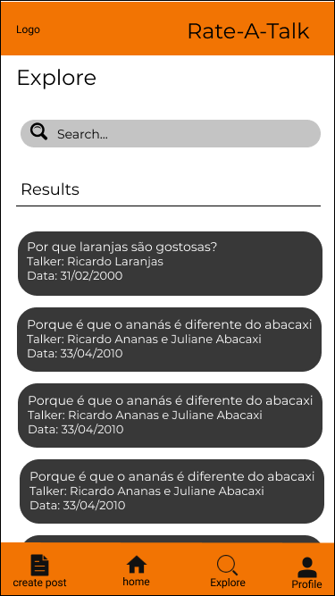

# openCX-your Rate-A-Talk Development Report

Welcome to the documentation pages of the Rate-A-Talk of openCX!

You can find here detailed about Rate-A-Talk, hereby mentioned as module, from a high-level vision to low-level implementation decisions, a kind of Software Development Report , organized by discipline (as of RUP):

* Business modeling 
  * [Product Vision](#Product-Vision)
  * [Elevator Pitch](#Elevator-Pitch)
* Requirements
  * [Use Case Diagram](#Use-case-diagram)
  * [User stories](#User-stories)
  * [Domain model](#Domain-model)
* Architecture and Design
  * [Logical architecture](#Logical-architecture)
  * [Physical architecture](#Physical-architecture)
  * [Prototype](#Prototype)
* [Implementation](#Implementation)
* [Test](#Test)
* [Configuration and change management](#Configuration-and-change-management)
* [Project management](#Project-management)


So far, contributions are exclusively made by the initial team, but we hope to open them to the community, in all areas and topics: requirements, technologies, development, experimentation, testing, etc.

Please contact us!

Thank you!

[João Matos](https://github.com/MechJM)

[Juliane Marubayashi](https://github.com/Jumaruba)

[Ricardo Nunes](https://github.com/TitanicThompson1)

[Rui Pinto](https://github.com/2dukes)

[Tiago Gomes](https://github.com/TiagooGomess)


----

## Product Vision
People use Rate-A-Talk app to share and fetch the most popular talks.


----
## Elevator Pitch

Do you ever get overwhelmed by the quantity of talks and how scattered they are through social media?

Rate-A-Talk aims to make your life simpler and provide a platform where you can discover the best talks suited for you!
In the app, you can find all kinds of talks, from Machine Learning to Perfomative Arts. But what sets us apart from the competition is the ability to rank the talks and their speakers in a colaborative way! Thus, you can find the best speakers to listen from.

So, what are you waiting for? Sign up today!


---
## Requirements

<br>

## Use case Diagram


<br>

### Search for a talk

* **Actor**: Attendee
* **Description**: Allows the user to search for a talk post. The user can search by name, location, or even date. The search redirects the user to the post of the talk
* **Preconditions and Postconditions**: The user may want to learn more about a talk, like the date and location. After the search, he/she will know everything about it.
* **Normal Flow**:
    * **User**: Clicks in the search bar.
    * **System**: Opens the search submenu and presents the last searches from the user.
    * **User**: Types and sends the name of the talk
    * **System**: Searches in the database for the talk, and returns the results.
* **Alternative Flows and Exceptions**:
    * **User**: Clicks in the search bar.
    * **System**: Opens the search submenu and presents the last searches from the user.
    * **User**: Clicks on one of the suggestions.
    * **System**: Searches in the database for the talk, and returns the results.

<br>

### Rate a talk

* **Actor**: Attendee
* **Description**: Allows the user to rate a talk that he/she attended. After the talk, the attendee will be able to rate from 1 star (very bad), to a maximum of 5 start (excellent). 
* **Preconditions and Postconditions**: The user wants to rate a speaker. After rating, the app processes the rating and displays the new speaker rating.
* **Normal Flow**:
    * **User**: After the talk, clicks on the link given by
    * **System**: Opens the search submenu and presents the last searches from the user.
    * **User**: Types and sends the name of the talk
    * **System**: Searches in the database for the talk, and returns the results.
* **Alternative Flows and Exceptions**:
    * **User**: Clicks in the search bar.
    * **System**: Opens the search submenu and presents the last searches from the user.
    * **User**: Clicks on one of the suggestions.
    * **System**: Searches in the database for the talk, and returns the results.

<br>


### Add a talk

* **Actor**: Speaker
* **Description**: Allows a speaker to create a talk. The speaker introduces information about the talk, like the date, place, duration and other speakers. When finished, the post of the talk will be accessible to all other users.
* **Preconditions and Postconditions**: The speaker wants to create a talk to let other users know about it
* **Normal Flow**:
    * **User**: Click on create post button
    * **System**: Directs the user to the Create Conference Page
    * **User**: Adds the information needed and clicks on create talk
    * **System**: Adds the talk to the database.
    Redirects the user to a Done it! page
* **Alternative Flows and Exceptions**:
   * **User**: Click on create post button
    * **System**: Directs the user to the Create Conference Page
    * **User**: Adds the information needed and clicks on create talk
    * **System**: Verifies that a talk with the same Title, Date and Place exists. Throws an error

<br>

## User Stories

### Story #1
As a user I want to be able to rate a talk so that other users can use my rating to decise if they want to attend a similar talk???

### User interface mockup
[a introduzir]


### Acceptance tests
```Gherkin
Scenario: Rate a talk.
  Given The post of a talk that I have attended
  When I tap “Rate this talk”
  Then I give a score between 0 and 10
  And submit my rating
```

### Value and effort
* Value: Must have
* Effort: XL

### Story #2
As a user I want to be able to leave a comment about the talk so that I can give feedback to the speakers and organizers

### User interface mockup
[a introduzir]

### Acceptance tests
```Gherkin
Scenario: Leave a comment about a talk
  Given A talk's post that I have attended and rated
  When I tap “Leave comment”
  Then I can write a comment about that talk
  And tap the submit button to submit my comment
```
### Value and effort
* Value: Must have
* Effort: XL


### Story #3
As a user I want to be able to see the current rating of a talk so that I can make the decision if I want to attend it

### User interface mockup
[a introduzir]

### Acceptance tests
```Gherkin
Scenario: See rating of a talk
  Given A talk's post that is presented in the feed
  When I tap the talk post
  Then the conference rating appears on screen
```

### Value and effort
* Value: Must have
* Effort: M


### Story #4
As a user I want to be able to edit the given rating to a talk so that I can correct possibles errors I made in the previous rating

### User interface mockup
[a introduzir]

### Acceptance tests
```Gherkin
Scenario: Edit rating of a talk
  Given A post of a talk that I have rated
  When I tap the “Edit rating” button
  Then I can change the previous rating
```

### Value and effort
* Value: Must have
* Effort: M


### Story #5
As a user I want to be able to edit my talk’s post so that it can reflect the most current and up to date information about my talk 

### User interface mockup
[a introduzir]

### Acceptance tests
```Gherkin
Scenario: Edit talk’s post
  Given A talk’s post that was created by me
  When I tap the “Edit post” button
  And I change what I’ve written previously in the post
  Then the information on my post changes
```

### Value and effort
* Value: Could have
* Effort: M


### Story #6
As a user I want to be able to edit my profile so that I can update my current information or correct errors in it

### User interface mockup


### Acceptance tests
```Gherkin
Scenario: Edit the user profile
  Given My profile (screen or page????)
  When I tap “Edit profile” button
  And I change what I’ve written previously in my profile
  Then the information in my profile changes
```

### Value and effort
* Value: Could have
* Effort: M


### Story #7
As a user I want to be able to check which talks a speaker participated so that I can decide if I want to attend his next talk

### User interface mockup
[a introduzir]

### Acceptance tests
```Gherkin
Scenario: Inspecting a speaker profile
  Given The talk's speaker profile
  When I tap the "View talks" button
  Then I am redirected to a list of the talks the speaker participated
```

### Value and effort
* Value: Cool to
* Effort: A DEFINIR


### Story #8
As a user I want to be able to apply filters to narrow down the search results, such as the speaker, theme and rating, so that I can find the talks best suited for me and my preferences

### User interface mockup
[a introduzir]

### Acceptance tests
```Gherkin
Scenario: Search for a talk with filters
  Given The explore screen
  When I select the filters I want to apply
  And provide the values for each filter
  And tap the "Search" button
  Then the filtered results are shown
```

### Value and effort
* Value: Cool to have
* Effort: M


### Story #9
As a user I want to be able to sort the talks search results based on several criteria so that I can see first the talks that are mote interesting to me

### User interface mockup
[a introduzir]

### Acceptance tests
```Gherkin
Scenario: Search for a talk by criteria
  Given The explore screen
  When I select the sorting criteria
  And provide the values for each criteria (ascending/descending)
  And tap the "Search" button
  Then the sorted results are shown
```

### Value and effort
* Value: Cool to have
* Effort: M


### Story #10
As a user I want to be able to insert a query in the search bar and get matching results so that I can look up talks that I might be interested in

### User interface mockup


### Acceptance tests
```Gherkin
Scenario: Search for a talk with a query
  Given The explore screen
  When I tap the search bar
  And enter some information 
  And tap the "Search" button
  Then the matching results are shown
```

### Value and effort
* Value: Must have
* Effort: XL


### Story #11
As a user I want to be able to interact with the search results (pick one and go to the respective page) so that I can obtain more information about the talk I am interested in

### User interface mockup
##### Search mockup

##### Talk page mockup


### Acceptance tests
```Gherkin
Scenario: See search results
  Given The explore screen
  When I search a talk
  And tap one of the results
  Then I'm taken to the talk's post
```

### Value and effort
* Value: Must have
* Effort: L


### Story #12
As a user I want to be able to create a post for a talk so that other users can see post and attend the talk 

### User interface mockup


### Acceptance tests
```Gherkin
Scenario: A user wants to create a post
  Given The bottom navigation bar
  When I tap the "Create Post" button
  Then I'm taken to the post creation page
```

### Value and effort
* Value: Must have
* Effort: L


### Story #13
As a user I want to be able to interact with the feed results (pick one and go to the respective page) so that I can obtain more information about the talk I am interested in 

### User interface mockup

##### Feed mockup

##### Talk page mockup


### Acceptance tests
```Gherkin
Scenario: Looking at the feed
  Given The feed screen
  When I tap a suggested talk
  Then I'm taken to the talk's post
```

### Value and effort
* Value: Must have
* Effort: M

TO DO


### Domain model TODO

To better understand the context of the software system, it is very useful to have a simple UML class diagram with all the key concepts (names, attributes) and relationships involved of the problem domain addressed by your module.

---

## Architecture and Design TODO
The architecture of a software system encompasses the set of key decisions about its overall organization. 

A well written architecture document is brief but reduces the amount of time it takes new programmers to a project to understand the code to feel able to make modifications and enhancements.

To document the architecture requires describing the decomposition of the system in their parts (high-level components) and the key behaviors and collaborations between them. 

In this section you should start by briefly describing the overall components of the project and their interrelations. You should also describe how you solved typical problems you may have encountered, pointing to well-known architectural and design patterns, if applicable.

### Logical architecture
The purpose of this subsection is to document the high-level logical structure of the code, using a UML diagram with logical packages, without the worry of allocating to components, processes or machines.

It can be beneficial to present the system both in a horizontal or vertical decomposition:
* horizontal decomposition may define layers and implementation concepts, such as the user interface, business logic and concepts; 
* vertical decomposition can define a hierarchy of subsystems that cover all layers of implementation.

### Physical architecture
The goal of this subsection is to document the high-level physical structure of the software system (machines, connections, software components installed, and their dependencies) using UML deployment diagrams or component diagrams (separate or integrated), showing the physical structure of the system.

It should describe also the technologies considered and justify the selections made. Examples of technologies relevant for openCX are, for example, frameworks for mobile applications (Flutter vs ReactNative vs ...), languages to program with microbit, and communication with things (beacons, sensors, etc.).

### Prototype
To help on validating all the architectural, design and technological decisions made, we usually implement a vertical prototype, a thin vertical slice of the system.

In this subsection please describe in more detail which, and how, user(s) story(ies) were implemented.

---

## Implementation TODO
Regular product increments are a good practice of product management. 

While not necessary, sometimes it might be useful to explain a few aspects of the code that have the greatest potential to confuse software engineers about how it works. Since the code should speak by itself, try to keep this section as short and simple as possible.

Use cross-links to the code repository and only embed real fragments of code when strictly needed, since they tend to become outdated very soon.

---
## Test TODO

There are several ways of documenting testing activities, and quality assurance in general, being the most common: a strategy, a plan, test case specifications, and test checklists.

In this section it is only expected to include the following:
* test plan describing the list of features to be tested and the testing methods and tools;
* test case specifications to verify the functionalities, using unit tests and acceptance tests.
 
A good practice is to simplify this, avoiding repetitions, and automating the testing actions as much as possible.

---
## Configuration and change management TODO

Configuration and change management are key activities to control change to, and maintain the integrity of, a project’s artifacts (code, models, documents).

For the purpose of ESOF, we will use a very simple approach, just to manage feature requests, bug fixes, and improvements, using GitHub issues and following the [GitHub flow](https://guides.github.com/introduction/flow/).


---

## Project management TODO

Software project management is an art and science of planning and leading software projects, in which software projects are planned, implemented, monitored and controlled.

In the context of ESOF, we expect that each team adopts a project management tool capable of registering tasks, assign tasks to people, add estimations to tasks, monitor tasks progress, and therefore being able to track their projects.

Example of tools to do this are:
  * [Trello.com](https://trello.com)
  * [Github Projects](https://github.com/features/project-management/com)
  * [Pivotal Tracker](https://www.pivotaltracker.com)
  * [Jira](https://www.atlassian.com/software/jira)

We recommend to use the simplest tool that can possibly work for the team.


---

## Evolution - contributions to open-cx TODO

Describe your contribution to open-cx (iteration 5), linking to the appropriate pull requests, issues, documentation.
