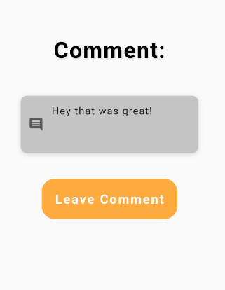
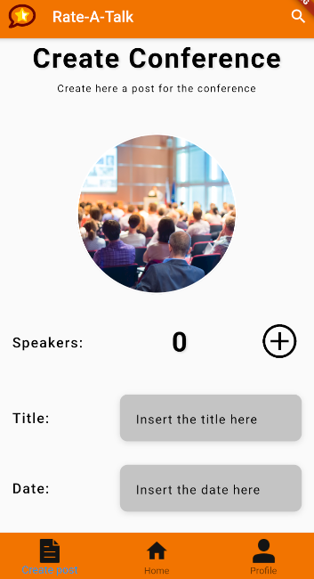
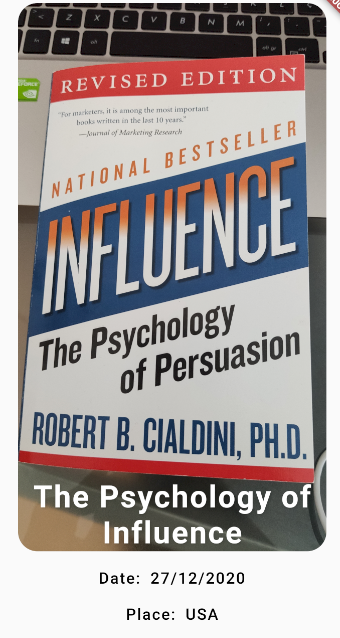
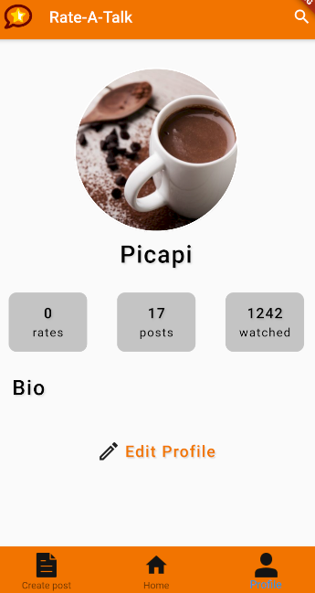

# openCX-your Rate-A-Talk Development Report

Welcome to the documentation pages of the Rate-A-Talk of openCX!

You can find here detailed about Rate-A-Talk, hereby mentioned as module, from a high-level vision to low-level implementation decisions, a kind of Software Development Report , organized by discipline (as of RUP):

* Business modeling 
  * [Product Vision](#Product-Vision)
  * [Elevator Pitch](#Elevator-Pitch)
* Requirements
  * [Use Case Diagram](#Use-case-diagram)
  * [User stories](#User-stories)
  * [Domain model](#Domain-model)
* Architecture and Design
  * [Logical architecture](#Logical-architecture)
  * [Physical architecture](#Physical-architecture)
  * [Prototype](#Prototype)
* [Implementation](#Implementation)
* [Test](#Test)
* [Configuration and change management](#Configuration-and-change-management)
* [Project management](#Project-management)


So far, contributions are exclusively made by the initial team, but we hope to open them to the community, in all areas and topics: requirements, technologies, development, experimentation, testing, etc.

Please contact us!

Thank you!

[João Matos](https://github.com/MechJM)

[Juliane Marubayashi](https://github.com/Jumaruba)

[Ricardo Nunes](https://github.com/TitanicThompson1)

[Rui Pinto](https://github.com/2dukes)

[Tiago Gomes](https://github.com/TiagooGomess)


----

## Product Vision
People use Rate-A-Talk app to share and fetch the most popular talks.


----
## Elevator Pitch

Do you ever get overwhelmed by the quantity of talks and how scattered they are through social media?

Rate-A-Talk aims to make your life simpler and provide a platform where you can discover the best talks suited for you!
In the app, you can find all kinds of talks, from Machine Learning to Perfomative Arts. But what sets us apart from the competition is the ability to rank the talks and their speakers in a colaborative way! Thus, you can find the best speakers to listen from.

So, what are you waiting for? Sign up today!


---
## Requirements

<br>

## Use case Diagram


<br>

### Search for a talk

* **Actor**: Attendee
* **Description**: Allows the user to search for a talk post. The user can search by name, location, or even date. The search redirects the user to the post of the talk
* **Preconditions and Postconditions**: The user may want to learn more about a talk, like the date and location. After the search, he/she will know everything about it.
* **Normal Flow**:
    * **User**: Clicks in the search bar.
    * **System**: Opens the search submenu and presents the last searches from the user.
    * **User**: Types and sends the name of the talk
    * **System**: Searches in the database for the talk, and returns the results.
* **Alternative Flows and Exceptions**:
    * **User**: Clicks in the search bar.
    * **System**: Opens the search submenu and presents the last searches from the user.
    * **User**: Clicks on one of the suggestions.
    * **System**: Searches in the database for the talk, and returns the results.

<br>

### Rate a talk

* **Actor**: Attendee
* **Description**: Allows the user to rate a talk that he/she attended. After the talk, the attendee will be able to rate from 1 star (very bad), to a maximum of 5 start (excellent). 
* **Preconditions and Postconditions**: The user wants to rate a speaker. After rating, the app processes the rating and displays the new speaker rating.
* **Normal Flow**:
    * **User**: After the talk, clicks on the link given by
    * **System**: Opens the search submenu and presents the last searches from the user.
    * **User**: Types and sends the name of the talk
    * **System**: Searches in the database for the talk, and returns the results.
* **Alternative Flows and Exceptions**:
    * **User**: Clicks in the search bar.
    * **System**: Opens the search submenu and presents the last searches from the user.
    * **User**: Clicks on one of the suggestions.
    * **System**: Searches in the database for the talk, and returns the results.

<br>


### Add a talk

* **Actor**: Speaker
* **Description**: Allows a speaker to create a talk. The speaker introduces information about the talk, like the date, place, duration and other speakers. When finished, the post of the talk will be accessible to all other users.
* **Preconditions and Postconditions**: The speaker wants to create a talk to let other users know about it
* **Normal Flow**:
    * **User**: Click on create post button
    * **System**: Directs the user to the Create Conference Page
    * **User**: Adds the information needed and clicks on create talk
    * **System**: Adds the talk to the database.
    Redirects the user to a Done it! page
* **Alternative Flows and Exceptions**:
   * **User**: Click on create post button
    * **System**: Directs the user to the Create Conference Page
    * **User**: Adds the information needed and clicks on create talk
    * **System**: Verifies that a talk with the same Title, Date and Place exists. Throws an error

<br>

## User Stories

### Story #1
As a user I want to be able to rate a talk so that other users can use my rating to decide if they want to attend it in the future

### User interface mock-up

##### Button to leave a rating


##### Screen where the user can actually leave the rating


### Acceptance tests
```Gherkin
Scenario: Rate a talk.
  Given The post of a talk that I have attended
  When I tap "Rate talk"
  And I insert a rate
  And I tap "OK",
  Then the talk's post appears
```

### Value and effort
* Value: Must have
* Effort: XL

### Story #2
As a user I want to be able to leave a comment about the talk so that I can give feedback to the speakers and organizers

### User interface mock-up

##### Button to leave a comment


##### Screen where the user can actually leave the comment


### Acceptance tests
```Gherkin
Scenario: Leave a comment about a talk
  Given A talk's post that I have attended and rated
  When I tap "Leave a comment"
  And I tap "Comment"
  And I write "Hey that was great!"
  And I tap "Leave Comment"
  And I tap "See all comments"
  Then my comment appears
```
### Value and effort
* Value: Must have
* Effort: XL


### Story #3
As a user I want to be able to see the current rating of a talk so that I can make the decision if I want to attend it

### User interface mock-up


### Acceptance tests
```Gherkin
Scenario: See rating of a talk
  Given A talk's post that is presented in the feed
  When I am in the talk's post
  Then the current rating appears
```

### Value and effort
* Value: Must have
* Effort: M


### Story #4
As a user I want to be able to edit the given rating to a talk so that I can correct possibles errors I made in the previous rating

### User interface mock-up

##### Button to leave the new rating


##### Screen where the user actually can leave the new rating


### Acceptance tests
```Gherkin
Scenario: Edit rating of a talk
  Given A post of a talk that I have rated
  When I tap "Rate talk"
  And I insert a rate
  And I tap "OK",
  Then the talk's post appears
```

### Value and effort
* Value: Must have
* Effort: M


### Story #5
As a user I want to be able to edit my talks post so that it can reflect the most current and up to date information about my talk 

### User interface mock-up
##### Button to edit the talk post


##### Edit post screen


### Acceptance tests
```Gherkin
Scenario: Edit talk's post
  Given A talk's post that was created by me
  When I tap "Edit post"
  And I write "Windows" in "Title"
  And I tap "Submit"
  Then I am in feed screen
```

### Value and effort
* Value: Could have
* Effort: M


### Story #6
As a user I want to be able to edit my profile so that I can update my current information or correct errors in it

### User interface mock-up


### Acceptance tests
```Gherkin
Scenario: Edit the user profile
  Given My profile screen
  When I tap "Edit Profile" button
  And I write "pickipicki" in "New Name"
  And I tap "Submit"
  Then "pickipicki" appears
```

### Value and effort
* Value: Could have
* Effort: M


### Story #7
As a user I want to be able to sort the talks search results based on several criteria so that I can see first the talks that are more interesting to me

### User interface mock-up


### Acceptance tests
```Gherkin
Scenario: Search for a talk by criteria
  Given The home screen
  When I tap the "Search Bar" icon
  And I write "tech" in "Search Bar"
  And tap the "Search" button
  Then talks with the tag "tech" appears 
```

### Value and effort
* Value: Cool to have
* Effort: M


### Story #8
As a user I want to be able to insert a query in the search bar, get matching results and interact with them so that I can look up talks that I might be interested in

### User interface mock-up


### Acceptance tests
```Gherkin
Scenario: Search for a talk with a query
  Given The home screen
  When I tap "Search Bar"
  And I write "Por que laranjas" in "Search Bar"
  And tap the "Search" icon
  Then "Por que laranjas são gostosas?" appears
```

### Value and effort
* Value: Must have
* Effort: XL


### Story #9
As a user I want to be able to create a post for a talk so that other users can see post and attend the talk 

### User interface mock-up


### Acceptance tests 
```Gherkin
Scenario: A user wants to create a post
  Given The bottom navigation bar
  When I tap "Create post"
  And I fill the necessary info to create a post
  Then the talk's post is created
```

### Value and effort
* Value: Must have
* Effort: L


### Story #10
As a user I want to be able to interact with the feed results (pick one and go to the respective page) so that I can obtain more information about the talk I am interested in 

### User interface mock-up 

##### Feed mock-up

##### Talk page mock-up


### Acceptance tests 
```Gherkin
Scenario: Interacting with feed
  Given The feed screen
  When I tap a post talk 
  Then I'm taken to the talk's post
```

### Value and effort
* Value: Must have
* Effort: M

### Story #11
As a user I want to be able to check my profile so that I can see my current information

### User interface mock-up


### Acceptance tests
```Gherkin
Scenario: The user wants to check his information
  Given The home screen
  When I tap "Profile"
  Then My profile is presented
```

### Value and effort
* Value: Cool to have
* Effort: M

### Story #12
As a user I want to be able to see the comments left about a talk so that I can better comprehend its quality 

### User interface mock-up

##### Button to see all comments

##### Screen showing the comments


### Acceptance tests
```Gherkin
Scenario: The user wants to check out the comments
  Given The post talk screen
  When I tap "See all comments"
  Then The list of comments appears
```
### Value and effort
* Value: Cool to have
* Effort: M

### Story #13

As a user I want to be able to see all the talks in the app so that I can find one that satisfies me

### User interface mock-up

##### Button to see all talks


##### Screen showing all the talks


### Acceptance tests
```Gherkin
Scenario: The user wants the see all talks
  Given The home screen
  When I tap "See all"
  Then A list with all the talks appears
```
### Value and effort
Value: Cool to have  
Effort: M

### Story #14

As a user I want to be able to see all the posts I created so that I can remember which talks I introduced to the app

### User interface mock-up

#### Button to see user's created talks


#### Screen showing all created talks


### Acceptance tests
```Gherkin
Scenario: A user wants to see the posts he created
  Given The Profile screen
  When I tap "posts"
  Then a list of talks appears
```
### Value and effort
Value: Cool to have  
Effort: M


### Domain model


---

## Architecture and Design TODO
The architecture of a software system encompasses the set of key decisions about its overall organization. 

A well written architecture document is brief but reduces the amount of time it takes new programmers to a project to understand the code to feel able to make modifications and enhancements.

To document the architecture requires describing the decomposition of the system in their parts (high-level components) and the key behaviors and collaborations between them. 

In this section you should start by briefly describing the overall components of the project and their interrelations. You should also describe how you solved typical problems you may have encountered, pointing to well-known architectural and design patterns, if applicable.

### Logical architecture
The purpose of this subsection is to document the high-level logical structure of the code, using a UML diagram with logical packages, without the worry of allocating to components, processes or machines.  
In order to provide long-term maintenance of the code and allow easy understanding about it, our project was diveded in six sections: 
- `auth`: Tasks resposible for the user athentication in the app. The login and signup backend are done by this module.  
- `database`: Communication between the firestore database and some models of the app, so as the information from the cloud can be retrieved and also uploaded.  
- `model`: Models for each structure of database.  
- `screens`: Module responsible for drawing the app and allows the iteration user/program.  
- `services`: Module that estabilish the communications between the app and FireStorage services. The main goal for this service is to upload and download stored images.  
- `widgets`: Module with useful widgets created by our team. These widgets were packet so as to be used in scale and mantain the code structure.   
## Package diagram


### Physical architecture
The goal of this subsection is to document the high-level physical structure of the software system (machines, connections, software components installed, and their dependencies) using UML deployment diagrams or component diagrams (separate or integrated), showing the physical structure of the system.

It should describe also the technologies considered and justify the selections made. Examples of technologies relevant for openCX are, for example, frameworks for mobile applications (Flutter vs ReactNative vs ...), languages to program with microbit, and communication with things (beacons, sensors, etc.).

### Prototype
To help on validating all the architectural, design and technological decisions made, we usually implement a vertical prototype, a thin vertical slice of the system.

In this subsection please describe in more detail which, and how, user(s) story(ies) were implemented.

---

## Implementation TODO
Regular product increments are a good practice of product management. 

While not necessary, sometimes it might be useful to explain a few aspects of the code that have the greatest potential to confuse software engineers about how it works. Since the code should speak by itself, try to keep this section as short and simple as possible.

Use cross-links to the code repository and only embed real fragments of code when strictly needed, since they tend to become outdated very soon.

---
## Test TODO

There are several ways of documenting testing activities, and quality assurance in general, being the most common: a strategy, a plan, test case specifications, and test checklists.

In this section it is only expected to include the following:
* test plan describing the list of features to be tested and the testing methods and tools;
* test case specifications to verify the functionalities, using unit tests and acceptance tests.

A good practice is to simplify this, avoiding repetitions, and automating the testing actions as much as possible.

---
## Configuration and change management 

In this project, every time a group member developed a feature, he would first create a branch dedicated to it. He would only develop the feature inside this branch, alone or with another member of the group. When the feature was done and tested, the developer creates a pull request. This pull request needs to be approved by a minimum of two group members (excluding the developer).

This management allows a better work flow for every collaborator and diminishes the total number of errors related to collaborating workspaces.


---

## Project management 

In order to facility team communication and organization, [GitHub Projects](https://github.com/FEUP-ESOF-2020-21/open-cx-t4g2-codemasters/projects/1) was used to do the Project Management of this project.

The project has 5 columns: **Backlog**, **To Do**, **In Progress**, **Done** and **User Stories**. This columns are quite self-explanatory, so an explanation is not needed. It is important to note that, at the end of any iteration, the tasks that weren't finished are passed to the next one, so that the In Progress column appears empty at the end of every iteration.


---

## Evolution - contributions to open-cx TODO

Describe your contribution to open-cx (iteration 5), linking to the appropriate pull requests, issues, documentation.
